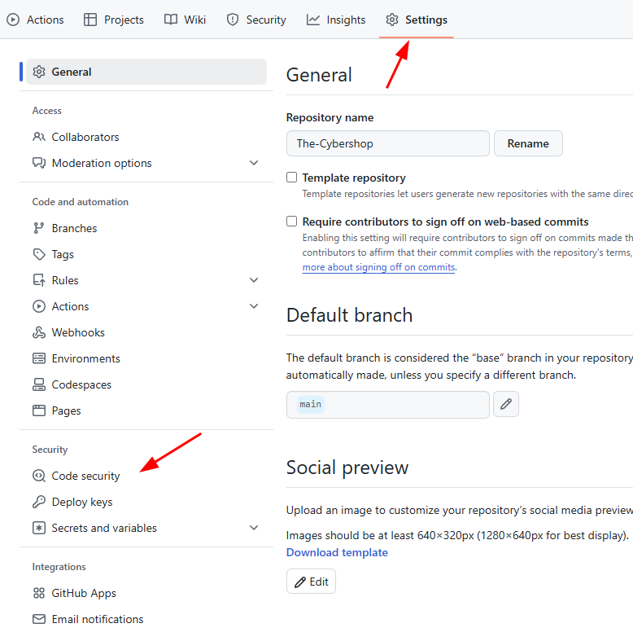
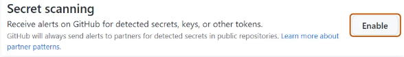

# Secrets Scan

## Description

Several tools exist to make developers' lives easier, particularly to automatically search for sensitive data that they may have accidentally left in the source code of their applications.

## Methods

### Enabling secret scanning on your repository with GHAS (Github Advanced Security)

1. Go to your repository, then click on "Settings" and "Code security" :

2. And in the "Secret Scanning" menu, click on "Enable" :

## Inspired by

- [Github - Enabling-secret-scanning-for-your-repository](https://docs.github.com/en/code-security/secret-scanning/enabling-secret-scanning-features/enabling-secret-scanning-for-your-repository)

- [OWASP SAMM - Security Testing](https://owaspsamm.org/model/verification/security-testing/)

- [OWASP DSOMM - Test for stored secrets](https://dsomm.owasp.org/activity-description?uuid=c6e3c812-56e2-41b0-ae01-b7afc41a004c&dimension=Test%20and%20Verification&subDimension=Static%20depth%20for%20infrastructure&level=1&activityName=Test%20for%20stored%20secrets)

## Tools

- [Github Advanced Security](https://docs.github.com/en/get-started/learning-about-github/about-github-advanced-security)